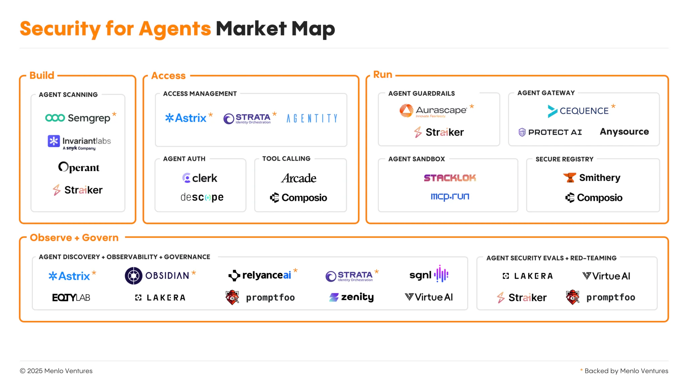

- agent are becoming more powerful and widely spread
- with corporate adoption increasing, governance, control and security become essential
- Who has had an agent do something unexpected?
- Who has had an agent do something problematic?

In a broader test showcase, we shoudl then show ASI01 and ASI02, goal hijack and
tool misuse and exploitation.

Agent seucrity map


Add in image about the deterministic part vs non-deterministic part of agents. Include the scale of more exposure/tools -> more powerful/useful agents.

Include this video of remote mcp stealing keys from cursor.
<https://x.com/pulik_io/status/1910053590921535992/video/1>

Put this content shortened and ready for slides into an early section, where we start very high level with a description.

```
Security for AI Agents

Unlike traditional software with established security guardrails and protocols, newer agent architectures lack fundamental protections. AI agents introduce unprecedented security challenges because they possess unique behavioral patterns and access privileges that fundamentally differ from conventional applications:

    Broad, indiscriminate access. AI agents capable of interacting with a wide range of tools and data sources pose non-trivial security challenges: Unlike humans who deliberately choose specific tools, AI agents can autonomously reason through available tools without human oversight, chain multiple tools together in unpredictable ways, and, importantly, access everything available versus what’s minimally necessary. A maliciously crafted prompt or compromised server can result in unauthorized data exfiltration, destructive operations, or other exploitative behaviors.
    Blind instruction following (and actioning). Black-box reasoning makes it impossible to predict or audit tool usage patterns, making post-incident forensics very difficult. Traditional logging and monitoring methods simply aren’t built for the complex chains of reasoning that occur when an AI agent autonomously orchestrates multiple tools. Security researchers have found significant vulnerabilities in MCP server implementations, with concerns about unsafe shell calls that could allow attackers to execute arbitrary code.
    Scale amplification. One compromised agent can affect thousands of operations instantly. Unlike traditional attacks that require manual effort to spread, a single malicious prompt can trigger cascading effects across an organization’s entire infrastructure. The math is sobering: If an agent can invoke 10 tools per minute and each tool can access multiple backend systems, a compromised agent could potentially touch hundreds of systems within an hour.
    Identity attribution. As agents increasingly act on behalf of humans, security teams face a dual identity challenge: Who authorized the action, and who executed it? Traditional identity and access management (IAM) tools were not built to answer this in real time, creating blind spots where a single compromised agent identity can cascade across multiple systems with unclear attribution chains. The result is a new category of identity orchestration challenges that pre-agent enterprise security frameworks struggle to address.

Threats to AI agents are not just theoretical—they are happening. Agent architectures make known, existing attacks more complex as they are weaponized by autonomous agents that can operate without human oversight. At the same time, these agent architectures have also brought about a new class of attacks that exploit the unique characteristics of AI decision-making and execution.
```
